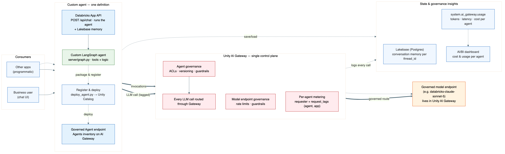
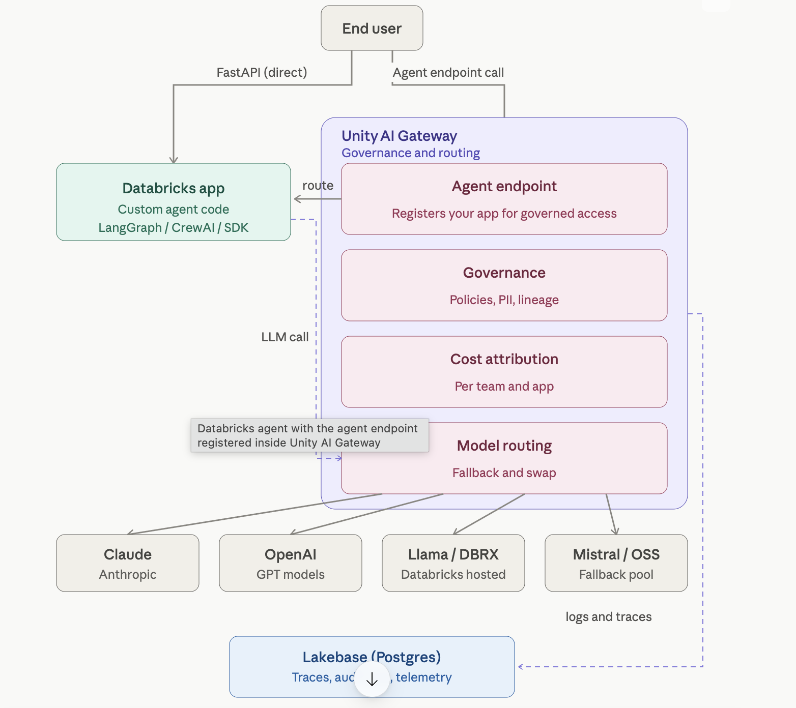
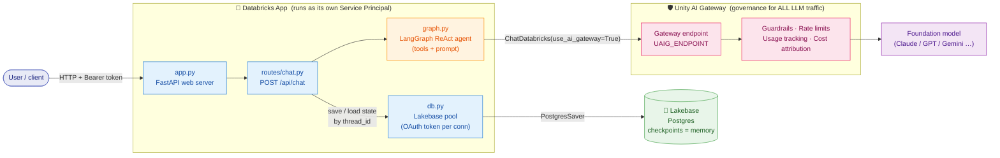
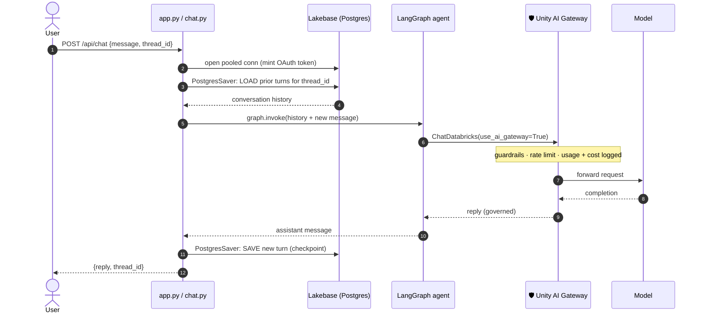
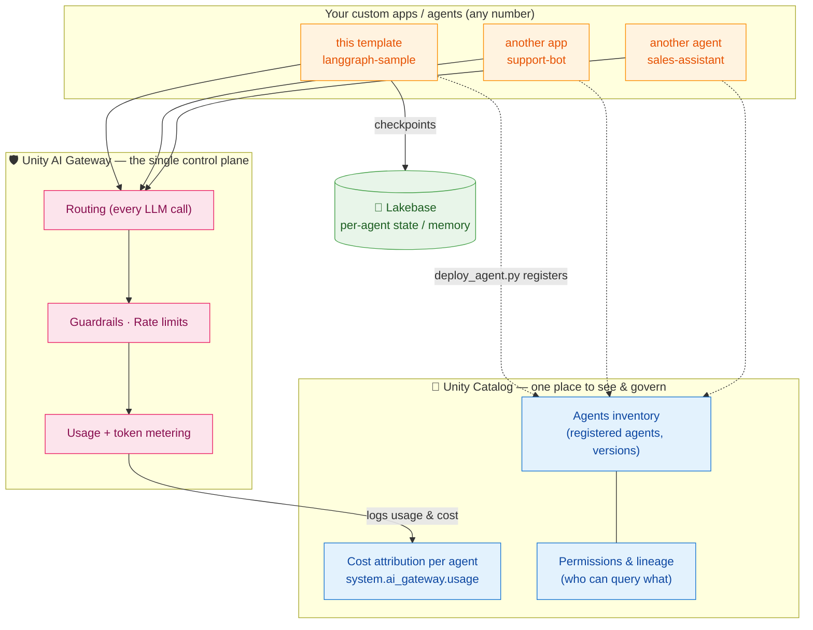

# How this template works (read this first)

A plain-language walkthrough of every moving part, with the exact file + line to look
at. If you're handed this repo and told "run it," read this once and you'll understand
what each file does and how a message flows through the system.

---

## The big picture



Consumers (chat UI or other apps) call **one** custom agent definition (`server/graph.py`).
Every LLM call is **routed through Unity AI Gateway** — the single control plane that applies
guardrails + rate limits and **meters usage/cost per agent** (`system.ai_gateway.usage` →
AI/BI dashboard). Conversation memory lives in **Lakebase (Postgres)** per `thread_id`. The
same agent is registered via `deploy_agent.py` so it appears on the **Agents inventory** in
Unity Catalog — so *every* agent you build is governed and cost-attributed **in one place**.

> Editable diagram sources are in [`docs/diagrams/`](diagrams/) — `.drawio` (open in
> [draw.io](https://app.diagrams.net) / Lucidchart) and `.mmd` (Mermaid).

### Two ways in, one governed path out



The end user reaches the agent **two ways**: directly via the **FastAPI** app, or via the
**registered Agent endpoint**. Either way, the app's **custom agent code** (LangGraph /
CrewAI / SDK) makes its LLM call through **Unity AI Gateway**, which handles it all in one
layer:

- **Agent endpoint** — registers your app for governed, first-class access.
- **Governance** — policies, PII handling, lineage.
- **Cost attribution** — per team and per app.
- **Model routing** — swap models or fall back across providers (**Claude, OpenAI,
  Llama/DBRX, Mistral/OSS**) with no code change.

All logs, audit records, and telemetry land in **Lakebase (Postgres)** — the same store
that holds conversation memory — so traces and cost are queryable like any other data asset.

---

## The 10,000-ft view (component flow)

Every LLM call goes through **Unity AI Gateway** (🛡️). Every conversation is saved in
**Lakebase Postgres** (💾). Every agent is inventoried and cost-attributed in one place in
**Unity Catalog** (📇).



<details><summary>Plain-text version of the same diagram (no Mermaid renderer needed)</summary>

```
        ┌─────────────────────── Databricks App (its own Service Principal) ─────────┐
 user   │  app.py (FastAPI)                                                           │
 ──────►│    POST /api/chat  ─►  routes/chat.py  ─►  graph.py (the agent)             │
 HTTP   │                              │                    │                          │
        │                              │                    └─► ChatDatabricks ────────┼─► 🛡️ Unity AI Gateway ─► model
        │                              ▼                        (use_ai_gateway=True)   │   (guardrails, limits,
        │                       db.py (pool) ──PostgresSaver──► 💾 Lakebase (Postgres)  │    usage, cost)
        └────────────────────────────────────────────────────────────────────────────┘

Same agent (server/graph.py) is ALSO packaged by agent.py + deploy_agent.py and
registered as a governed agent on Unity AI Gateway (a serving endpoint).
```

One agent definition (`server/graph.py`), used two ways. Change the agent once, both update.

---

## 1. What is `app.py`? (the FastAPI web server)

`app.py` is the **web server** — a FastAPI app run by `uvicorn` (see `app.yaml`'s
`command`). It does three things:

1. **On startup** it opens the Lakebase connection pool (`app.py:19-22`, the `lifespan`).
2. It **mounts the chat API** under `/api` (`app.py:26` → `server/routes/chat.py`).
3. It **serves the web UI** (`static/index.html`) for anything that isn't `/api`.

It is a normal HTTP server. Nothing Databricks-specific about the framework — the
Databricks parts are auth + Lakebase + the LLM, all reached through the SDK.

## 2. What happens to a message sent to `/api/chat`?

Trace it in `server/routes/chat.py`:

1. A `POST /api/chat` arrives with `{"message": "...", "thread_id": "..."}` (`chat.py:29`).
2. If no `thread_id`, a new one is generated (`chat.py:30`) — this is the **conversation id**.
3. It borrows a DB connection from the Lakebase pool and wraps the graph with a
   **`PostgresSaver` checkpointer** (`chat.py:34-36`). *This is what gives the agent memory.*
4. `graph.invoke(...)` runs the agent for that `thread_id` (`chat.py:37-40`). LangGraph
   automatically loads prior turns for this `thread_id` from Lakebase and saves the new
   turn back.
5. The assistant's reply + `thread_id` are returned (`chat.py:42-43`).

Send the same `thread_id` again → it remembers. That memory lives in **Lakebase**, not in
the app's RAM, so it survives restarts and works across replicas.

**The full round-trip — one message, showing the Lakebase load/save and the gateway hop:**



Notice: **the LLM hop always goes through the gateway** (steps 6–10), and **state is read
before and written after** the agent runs (steps 3, 12) — that's the durable Lakebase memory.

## 3. What is `server/graph.py`? (THE agent — this is the core)

This is the actual agent. It's small on purpose:

- **The tool** — a `@tool` function (`graph.py:50`). This example has a `calculator`.
  Add tools by writing more `@tool` functions and adding them to the `TOOLS` list.
- **The LLM** — `build_llm()` (`graph.py:75`) returns
  `ChatDatabricks(model=<endpoint>, use_ai_gateway=True)` (`graph.py:84-86`).
- **The agent** — `build_graph()` (`graph.py:104`) calls LangGraph's
  `create_react_agent(llm, tools, ...)` (`graph.py:106`). A ReAct agent = "reason, then
  optionally call a tool, then answer."

## 4. Which model does the agent use, and HOW DO I SWAP IT?

The model is **one value**: the Unity AI Gateway endpoint name.

- It's read by `get_serving_endpoint()` in `server/config.py`, which returns
  `UAIG_ENDPOINT` (env var) → falls back to `SERVING_ENDPOINT` → default
  `databricks-claude-sonnet-5`.
- `build_llm()` passes it to `ChatDatabricks(model=..., use_ai_gateway=True)`.

**To swap the LLM, change ONE line — the `UAIG_ENDPOINT` value.** No code change.

| Where | How |
|---|---|
| Local run | edit `UAIG_ENDPOINT` in your `.env` |
| Deployed app | edit `UAIG_ENDPOINT` in `app.yaml`, redeploy |

Examples you can drop in: `databricks-claude-opus-4-8`, `databricks-gpt-5-5`,
`databricks-gemini-3-5-flash`. (List what your workspace has:
`databricks serving-endpoints list -p <profile> -o json | jq -r '.[].name'`.)

Because `use_ai_gateway=True`, **every** model call is routed through Unity AI Gateway —
so swapping the model, rate-limiting it, or adding guardrails is a gateway/UI concern,
not a code concern.

## 5. What is `agent.py`? (the same agent, packaged for a serving endpoint)

`agent.py` wraps the **same** `build_graph()` in an MLflow `ChatAgent` interface
(`agent.py:21`, `predict()` at `:32`, `set_model` at `:49`). This is the standard shape
Databricks expects so the agent can become a **Model Serving endpoint** and appear on the
Unity AI Gateway **Agents** inventory. It reuses `server/graph.py` — so it uses the exact
same model and tools as the app. (It runs stateless — no Lakebase — because a serving
endpoint receives full history each call.)

## 6. "Register to AI Gateway" — LLM vs Agent (two different things)

This is the part people confuse. There are **two** registrations:

**(a) The LLM is registered/governed** — automatically, by routing.
The moment the agent calls the model via `ChatDatabricks(use_ai_gateway=True)`, that LLM
traffic goes through Unity AI Gateway and is governed (rate limits, usage tracking,
guardrails). You don't "register" the LLM with code — you *route through* the gateway
endpoint (`UAIG_ENDPOINT`), and the gateway governs it. Grant is done in
`setup/02_grant_app_sp.sh` step (c) (`CAN_QUERY` on the endpoint).

**(b) The AGENT is registered** — explicitly, by `deploy_agent.py`.
This makes your agent a first-class, versioned entity on the Gateway **Agents** page:
1. **log** the MLflow ChatAgent, packaging `server/` and declaring the LLM endpoint it
   depends on (`resources=[DatabricksServingEndpoint(...)]`);
2. **register** it to Unity Catalog as a model (`<UC_CATALOG>.<UC_SCHEMA>.<name>`);
3. **deploy** it with `databricks.agents.deploy()` → a serving endpoint that shows up on
   the Agents inventory. Governance (guardrails/limits) is then set in the Gateway UI.

So: **routing governs the LLM; `deploy_agent.py` registers the agent.** Both are "AI
Gateway," but they're different layers — the doc `USAGE.md` shows how to *call* each.

## 7. One place for everything: governance, cost, and the agent inventory

This is the payoff of doing it the Databricks way. **However many custom apps/agents you
build, they all route through one Unity AI Gateway and are inventoried + cost-attributed in
one Unity Catalog.** No shadow AI, no per-team guesswork.



- **All LLM traffic** from every agent flows through the gateway → uniform guardrails +
  rate limits, and every call's tokens/cost land in **`system.ai_gateway.usage`** (query it
  or use the Gateway UI). That's how you **attribute cost per agent in one place**.
- **Registered agents** (via `deploy_agent.py`) appear together on the **Agents inventory**
  in Unity Catalog — versioned, permissioned, with lineage to the model + tools they use.
- **Lakebase** holds each agent's conversation state; because it's Postgres, that state is
  also queryable/loggable like any other data asset.

---

## The files, one line each

| File | What it is |
|---|---|
| `server/graph.py` | **The agent**: LLM + tools + ReAct graph. Edit behavior here. |
| `server/config.py` | Auth + which model (`get_serving_endpoint`). Rarely edited. |
| `server/db.py` | Lakebase connection pool (mints DB tokens per connection). |
| `server/routes/chat.py` | `POST /api/chat` — runs the agent with Lakebase memory. |
| `app.py` | FastAPI web server; opens the pool, serves API + UI. |
| `agent.py` | Same agent wrapped as an MLflow ChatAgent (for the endpoint). |
| `deploy_agent.py` | Logs → registers → deploys the agent onto the AI Gateway Agents page. |
| `app.yaml` | Deployed-app config: the env vars the app sees (incl. `UAIG_ENDPOINT`). |
| `.env.example` | The one file you edit to reuse the template. |
| `setup/01_provision_lakebase.sh` | **CREATES Lakebase** (project + database). |
| `setup/02_grant_app_sp.sh` | Grants the app SP: Postgres role + table grants + gateway CAN_QUERY. |
| `setup/03_deploy_app.sh` | Creates + syncs + deploys the app. |
| `static/index.html` | No-build chat UI (so npm isn't required). |

Follow the numbered steps in the main **README.md**; this doc explains the *why*.
